# [iOS] Notes App 101

[Tutorial video on Youtube](https://www.youtube.com/watch?v=35XTc5X_vkk&list=PLVbJM_d1L3gQ0dzZCUkLwhadm7l-g7ZiD) by Vea Software

## 1.Create new repository in Parse
### QuickStart --> Data --> Mobile --> Swift --> Existing project --> Set up the SDK
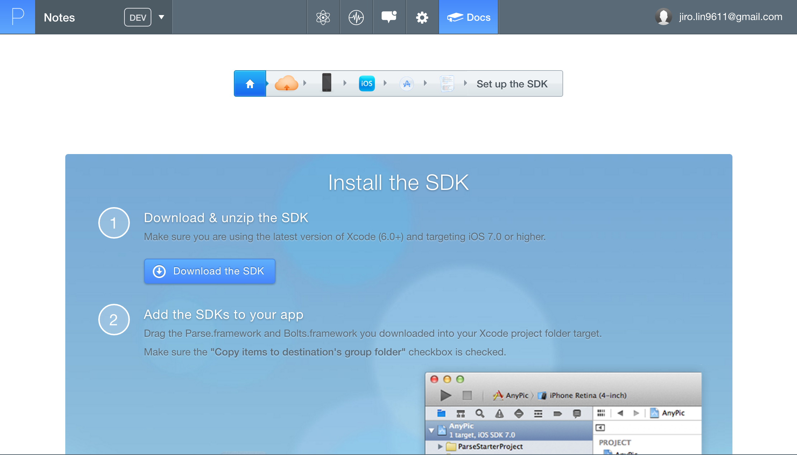

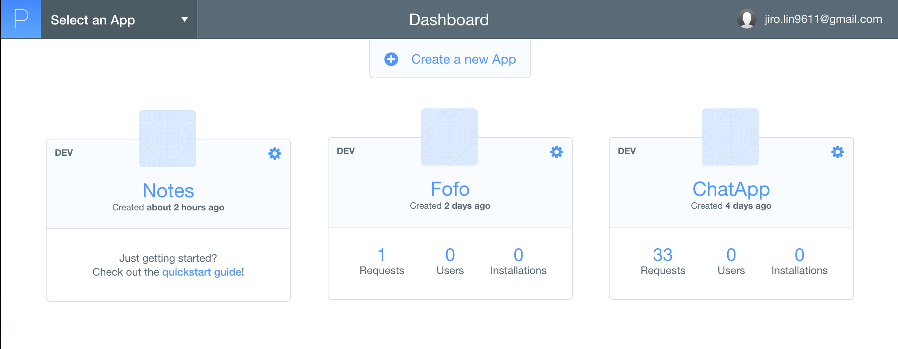

## 2.Create a new project in Xcode
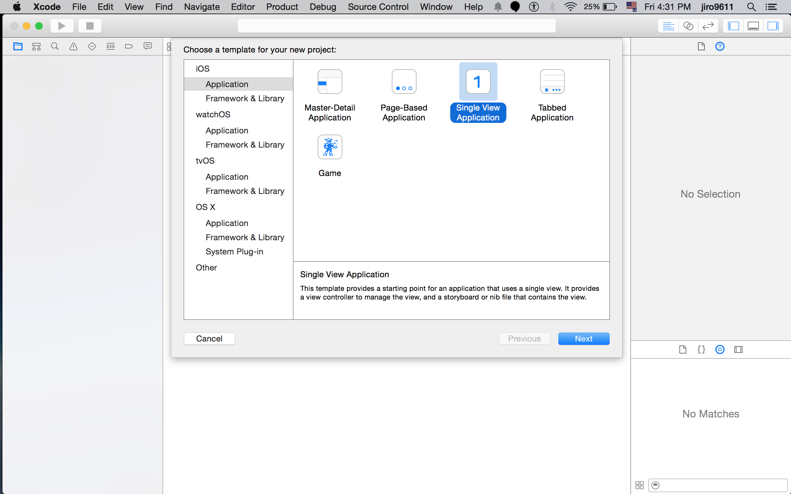

### Make sure you select right options
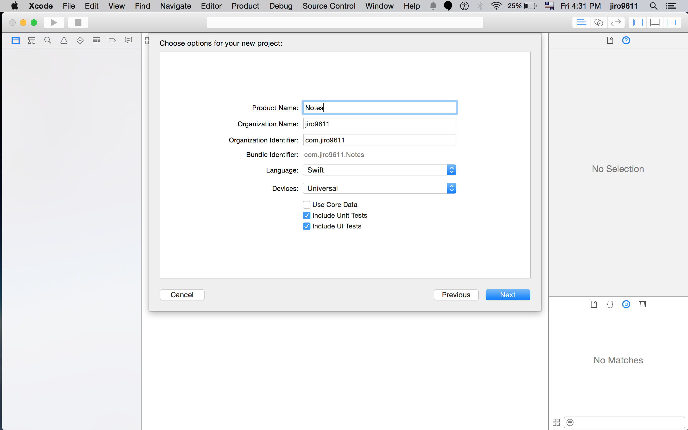

## 3.Download the SDK and import into project
### In the Parse quick start has link to download SDK.

1. Create a folder under your project folder
2. Unzip the Parse SDK file and put it into the folder you created
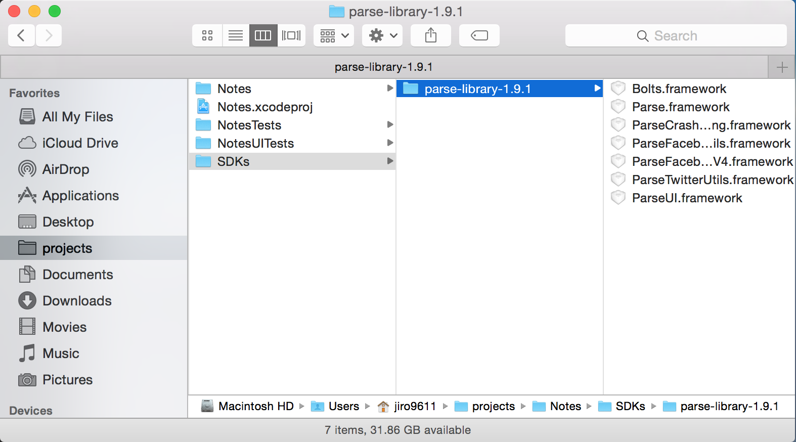
3. Drag the frameworks you needed and pull into the Xcode project
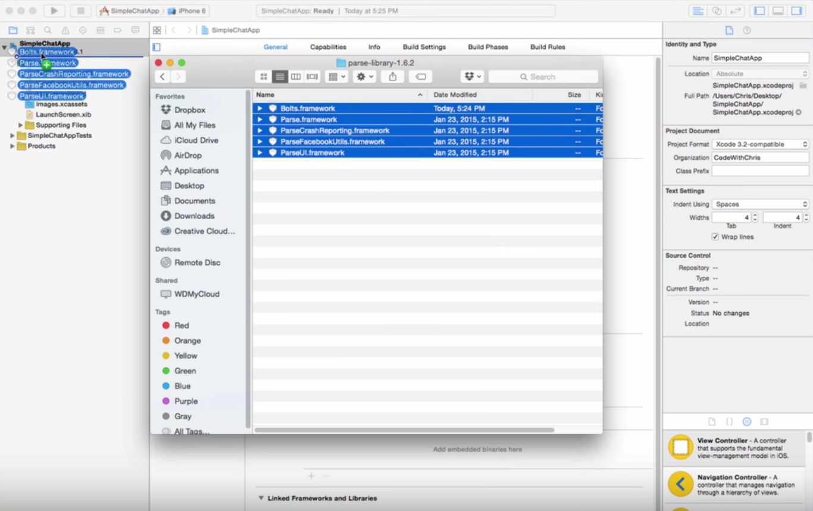
4. And make sure you checked the right option
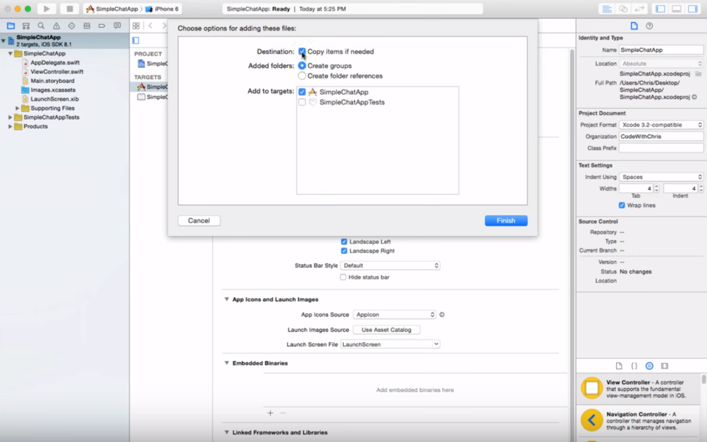

*Create a SDKs folder under your project is for the people who download your project can have complete files*

## 4.Add the dependencies
1. Click on Targets → Your app name → and then the 'Build Phases' tab. Expand 'Link Binary With Libraries' as shown. → Click the plus icon under the Link Binary section. *Or you can go to the General to see the bottom of interface has Link Binary with libraries, click the plus button under the Linked Frameworks and Libraries to add others dependences.*
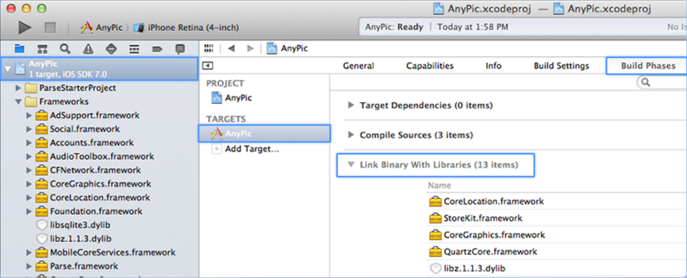
2. Add all the following libraries
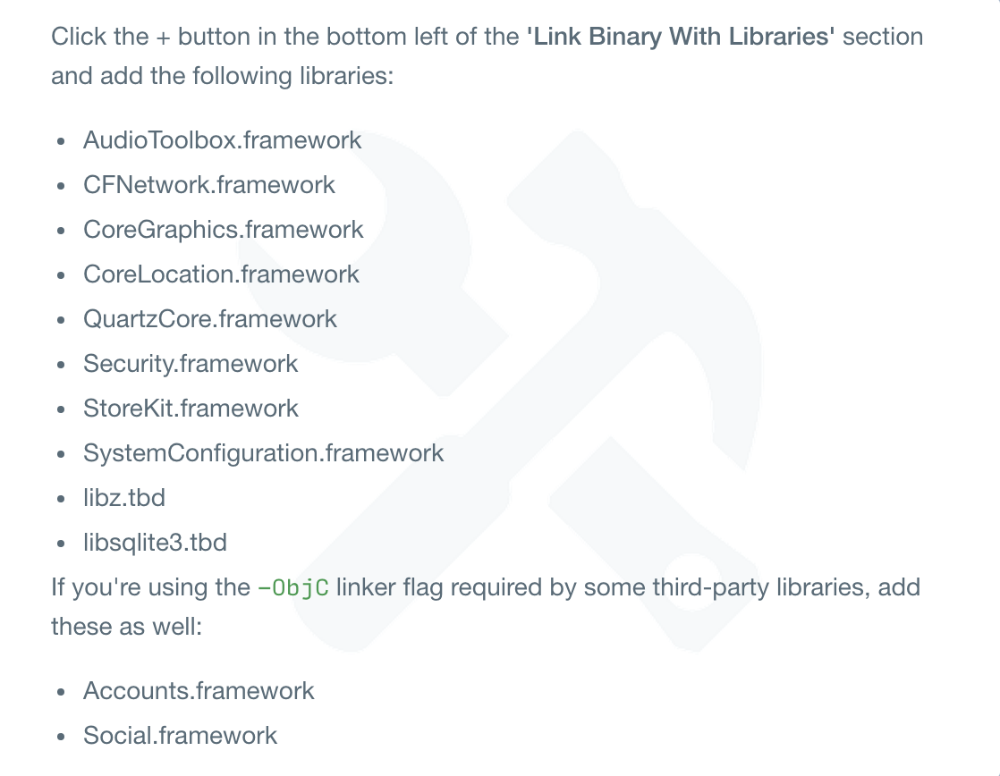
3. After added all frameworks then select it all right click mouse, and select “new group from selection”. Named the folder “Frameworks"
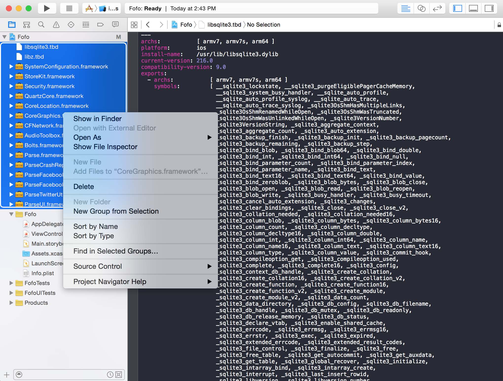

## 5.Create Bridging-header file
Even project is swift but sometime other plugin or framework may code in objective-c, therefore we have to create a bridging-header to connect swift and objective-c

1. Create a objective-c header file under the Notes folder
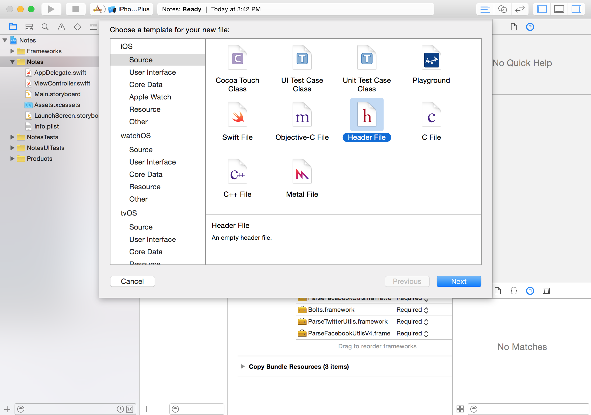
2. Name it "Bridging-header", and make sure selected targets "Notes" icon
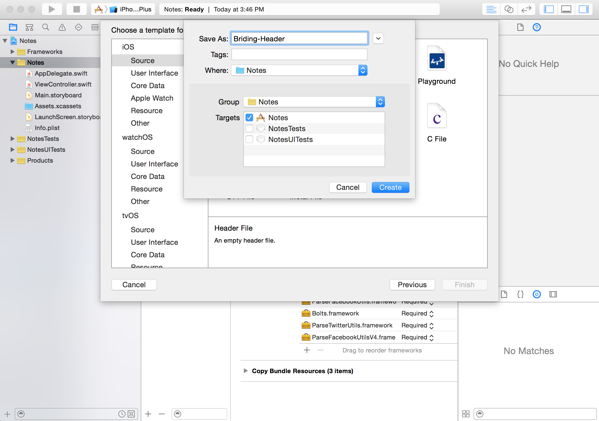
3. Suggest put the bridging-header file in the top of Notes folder
4. Go to the top of Notes project, and go to "Build Setting", and search for "Bridging" key word in search bar.
5. Double click the "Objective-C Bridging-header", it will pop up a block, then drag the bridging-header file that you just created into the block.
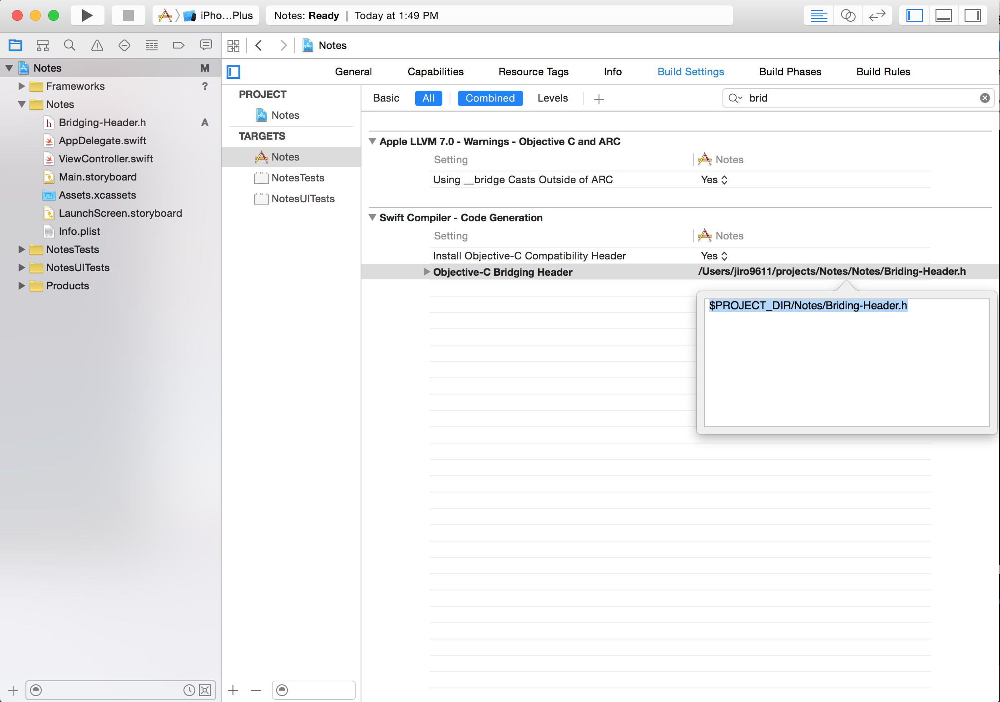
6. The original path will be static, but we will change it into "$PROJECT_DIR/Notes/Briding-Header.h". Therefore when other people download your project will automatically find out the correct path in their computer.

